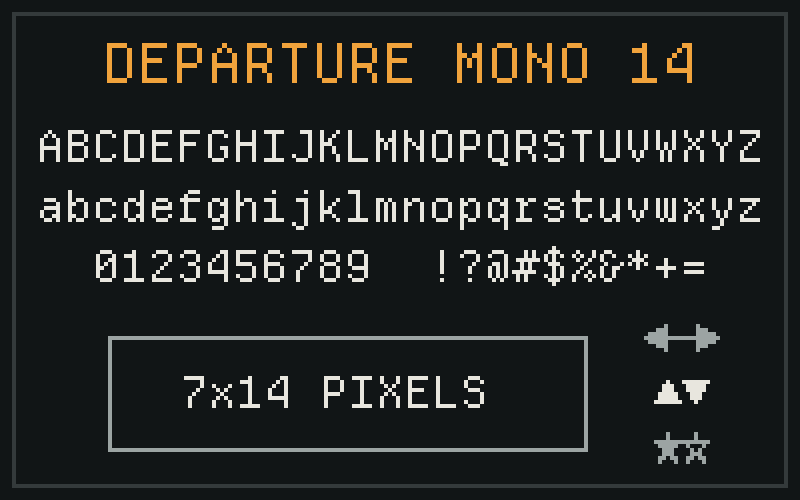

# Departure Mono 14

[Departure Mono](https://github.com/rektdeckard/departure-mono) by
[Helena Zhang](https://helenazhang.com) is my favorite pixel font, but it always [bugged](#why-14px-is-better) me that I had to set it to `11px`
for the pixels to line up properly, even though it is a 7×14 font.

I ran into the same confusing behavior described in
[upstream issue #24](https://github.com/rektdeckard/departure-mono/issues/24):
setting the font to `14px` does not produce a one-to-one mapping between the
font's pixels and screen pixels. At `11px`, the pixels align, while the glyph
cell is effectively 7×14 screen pixels.

Departure Mono 14 resolves that mismatch, it preserves the glyphs and
OpenType behavior of Departure Mono 1.500, but stores them as human-readable
7×14 bitmap sources and rebuilds the font with a 700-unit em. As a result, one
design pixel maps exactly to one CSS pixel at
`font-size: 14px`. 

As a bonus, the project also produces a BDF version for
environments that support true bitmap fonts.

## Downloads

Ready-to-use BDF, OTF, and WOFF2 files are published on the
[GitHub Releases page](../../releases).



## Why 14px is better

The original font can be pixel-perfect, but at its intended size the CSS
measurements do not agree:

```css
font-size: 11px;
line-height: 14px;
```

The glyph cell is 7×14px, while `1em` is only 11px. In practice:

- containers sized in `em` can be too short and clip the text;
- spacing and inline icons use an 11px reference while the line occupies 14px;
- missing glyphs come from fallback fonts at 11px and can have noticeably
  different dimensions;
- setting the original font to common sizes such as 14px or 16px puts its
  design pixels on fractional CSS pixels;
- design tools and type scales treat it as 11px even when the layout needs a
  14px row;
- some [accessibility and design-audit tools](https://help.siteimprove.com/support/solutions/articles/80001217848-accessibility-checks-supported-by-the-siteimprove-accessibility-for-designers)
  flag the declared 11px size as too small.

Departure Mono 14 keeps the measurements in sync:

```css
font-size: 14px;
line-height: 14px;
```

At that size, one design pixel is one CSS pixel, the character advance is
7px, the complete cell is 7×14px, and `1em` matches the line height.

## Source layout

The human-readable files under `glyphs/` are the canonical font source. Each
glyph is stored as a visible 7×14 grid in the open
[YAFF 1.0 format](https://github.com/robhagemans/monobit/blob/master/YAFF.md):

```text
u+0041:
"A":
    .......
    .......
    .......
    ...@...
    ..@.@..
    .@...@.
    .@...@.
    .@@@@@.
    .@...@.
    .@...@.
    .@...@.
    .......
    .......
    .......
```

- `glyphs/uXXXX-uXXXX.yaff` contains the 1,079 directly encoded Unicode glyphs,
  divided into 256-codepoint pages.
- `glyphs/alternates.yaff` contains 107 named, unencoded OpenType alternates.
- `source/glyph-order.txt` fixes glyph identifiers and ordering.
- `source/opentype-layout.ttx` preserves the original GDEF, GPOS, and GSUB
  substitutions and positioning.
- `OFL.txt` contains the SIL Open Font License 1.1.
- `build_font.py` is the sole generation script. It builds every distributable
  font directly from the YAFF source and textual metadata.

## Generated formats

- `DepartureMono14-Regular.bdf` is a 7×14 monochrome bitmap font.
- `DepartureMono14-Regular.otf` and `.woff2` are generated from the YAFF pixels
  with a 700-unit em, so one design pixel equals one CSS pixel at
  `font-size: 14px`.

```text
50 / 700 × 14px = 1px
350 / 700 × 14px = 7px character advance
700 / 700 × 14px = 14px ascent-plus-descent
```

## Build and validate

```sh
python3 -m pip install -r requirements.txt
python3 build_font.py
python3 validate.py
```

The build reads only YAFF glyphs and the textual source metadata. Validation
loads every YAFF file with Monobit, compares every BDF row with YAFF, and checks
every generated outline pixel, metric, Unicode mapping, and OpenType layout
table.

## License and provenance

Departure Mono is Copyright 2022–2024
[Helena Zhang](https://helenazhang.com) and licensed under the SIL Open Font
License 1.1. The canonical YAFF glyph sources and generated fonts in this
derivative remain under that license. This independent project is not
affiliated with or endorsed by the original author.
